# SSH Brute-Force & Botnet Simulation Lab

> **Educational use only — FEUP SSR coursework.**
> All traffic is contained within isolated Docker/Podman bridge networks.
> No container has internet access or can reach the host filesystem.

---

## Overview

Containerised network lab that simulates SSH brute-force, lateral movement, and botnet propagation across segmented networks. Four scenarios of increasing complexity let you study attack behaviour, pivot techniques, and defensive countermeasures live.

- **Attacker** runs a Python botnet that scans, brute-forces SSH, and pivots through compromised hosts
- **Victims** run real OpenSSH with weak credentials, generating authentic auth logs
- **Honeypot** in an isolated segment catches lateral movement
- **Monitor** collects logs and runs detection rules
- **GUI** (`src/gui.py`) provides a real-time browser dashboard with live topology, defense controls, and attack reports

---

## Repository structure

```
ssh-botnet-lab/
├── docker-compose.yml          Base compose file (scenario 2 default)
├── scenarios/                  Per-scenario compose overrides
│   ├── scenario1.yml           Single flat network
│   ├── scenario2.yml           2 networks — 1 pivot (standard)
│   ├── scenario3.yml           3 networks — 2 parallel pivots
│   └── scenario4.yml           3 networks — 2-hop deep chain
│
├── attacker/                   Attacker container (Python + paramiko)
├── victim/                     Standard victim (Ubuntu + OpenSSH)
├── victim-b/                   Honeypot variant
├── victim-c/                   Deep-chain victim variant
├── monitor/                    IDS/log monitor container
│
├── scripts/                    Utility shell scripts
│   ├── setup.sh                Build and start containers
│   ├── install.sh              Install Docker/Podman dependencies
│   ├── auto_run.sh             One-command scenario runner
│   ├── defense_test.sh         Automated defense test suite
│   └── collect_data.sh         Dump all lab evidence to a folder
│
├── src/                        Python tools (run from project root)
│   ├── gui.py                  Real-time browser GUI (Flask-free SSE server)
│   ├── network_topology.py     Generate topology diagrams (docs/charts/)
│   └── visualize_defense_data.py  Plot defense comparison charts
│
├── docs/                       Documentation and generated assets
│   ├── DATA_COLLECTION.md
│   ├── scenarios_diagram.svg
│   ├── charts/                 Generated PNG diagrams and charts
│   └── report/                 Lab report outputs
│
└── data/                       Defense test results (per-scenario folders)
    ├── Scenes1Data/
    ├── Scenes2Data/
    ├── Scenes3Data/
    └── Scenes4Data/
```

---

## Quick start

### 1. Install dependencies (first time only)

```bash
sudo bash scripts/install.sh
```

### 2a. Interactive GUI mode (recommended)

```bash
python3 src/gui.py
```

Open **http://localhost:5000**. Click **S1–S4** to select a scenario — containers spin up automatically. Run Botnet unlocks when setup is complete. The dashboard shows real-time host discovery, brute-force attempts, compromised nodes, and pivot paths. Use the **Defenses** panel to apply fail2ban, IP blocking, rate-limiting, or disable-password-auth live.

### 2b. Fully automated mode (no GUI needed)

Runs all phases unattended — build, brute-force, lateral movement, C2, detection report:

```bash
bash scripts/auto_run.sh 2   # or 1 / 3 / 4
```

---

## Scenarios

| # | Networks | Pivots | Key concept |
|---|---|---|---|
| 1 | 1 (172.21.0.0/24) | 0 | Flat network, all hosts directly reachable |
| 2 | 2 + honeypot | 1 | Segmentation forces lateral movement via victim1 |
| 3 | 3 + honeypot | 2 | Parallel pivots — victim1→internal, victim2→extra |
| 4 | 3 | 2-hop chain | Deep chain — attacker→victim1→victim3→deep_net |

### Scenario 1 — Flat network

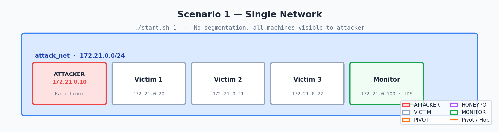

Single `attack_net`. Attacker reaches all victims directly — no pivoting required.

### Scenario 2 — Single pivot

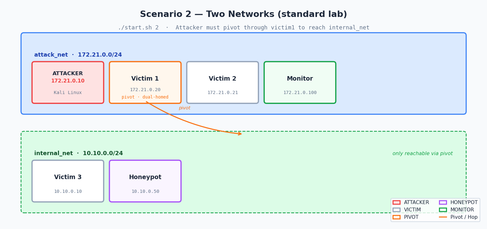

`attack_net` + `internal_net`. Attacker compromises victim1, then pivots through it to reach internal hosts and the honeypot.

### Scenario 3 — Parallel pivots

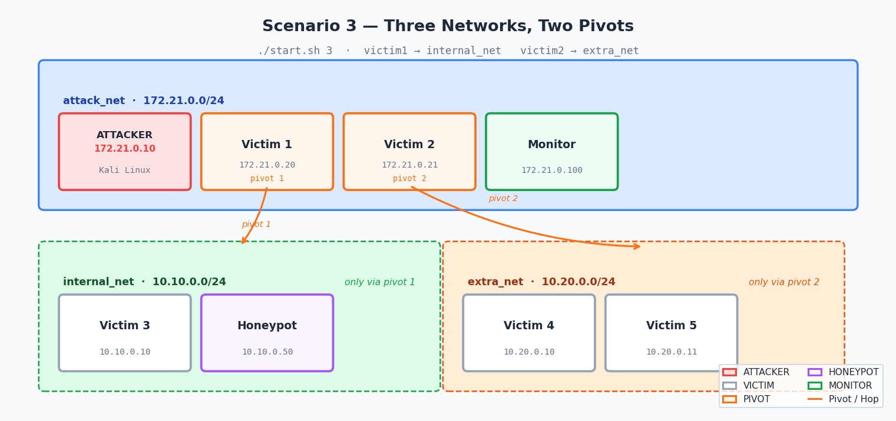

`attack_net` + `internal_net` + `extra_net`. Two independent pivot paths: victim1 → internal, victim2 → extra.

### Scenario 4 — Deep chain

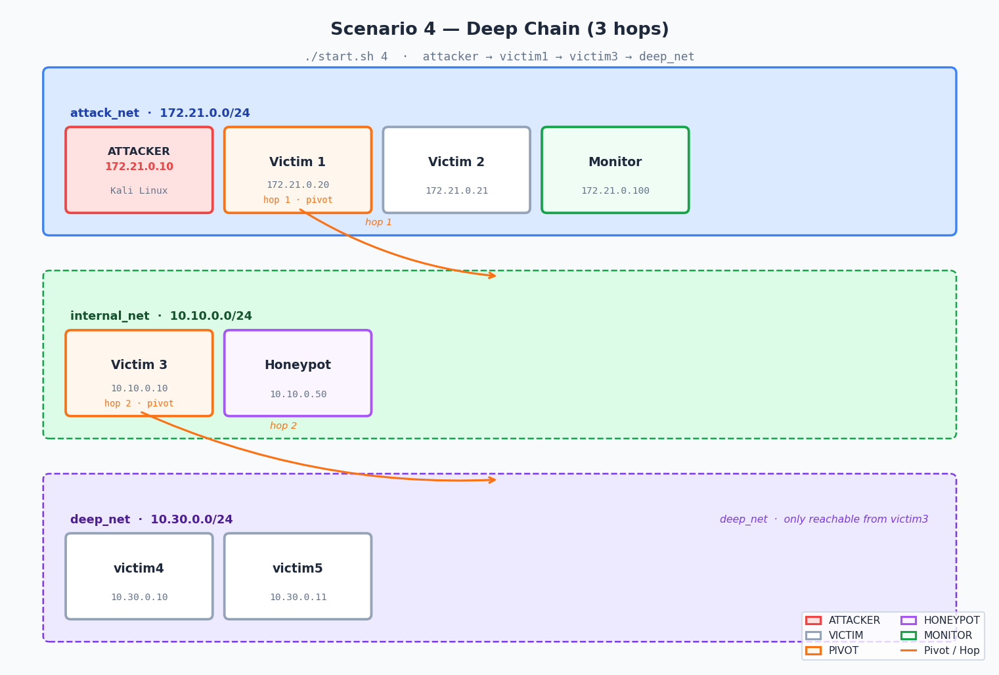

`attack_net` + `internal_net` + `deep_net`. Two-hop chain: attacker → victim1 → victim3 → deep segment.

---

## Defenses tested

| Defense | Mechanism |
|---|---|
| `fail2ban` | Bans attacker IP after 3 failed SSH attempts within 60 s |
| `block_ip` | iptables DROP all packets from attacker (172.21.0.10) |
| `rate_limit` | iptables conntrack: drops >10 new SSH connections per 60 s |
| `disable_password` | Sets `PasswordAuthentication no` in sshd_config and reloads sshd |

Apply via GUI or directly:

```bash
# GUI endpoint
curl "http://localhost:5000/defend?action=fail2ban&target=victim1"

# Or run the automated defense test suite (needs gui.py running)
bash scripts/defense_test.sh 2
```

---

## Defense results

Defense comparison charts per scenario (generated by `src/visualize_defense_data.py`):

| Scenario 1 | Scenario 2 |
|:---:|:---:|
| 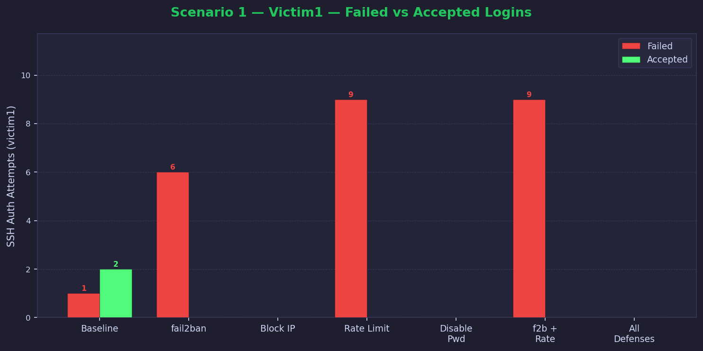 | 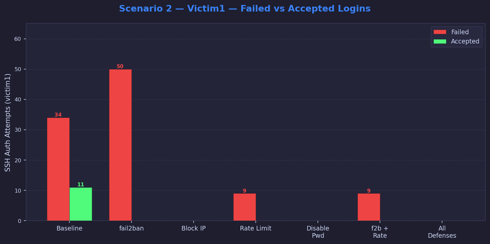 |
| 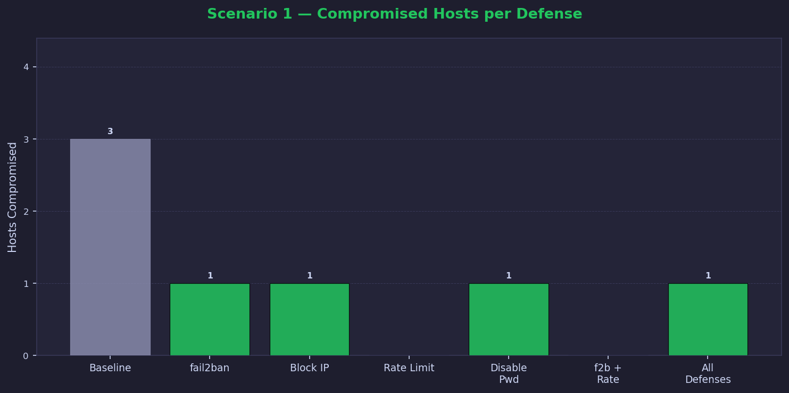 | 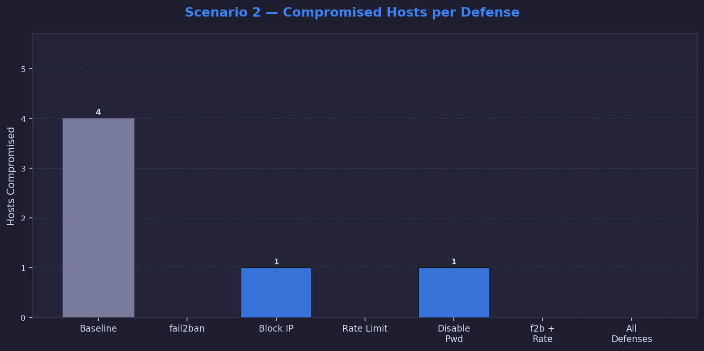 |

| Scenario 3 | Scenario 4 |
|:---:|:---:|
| 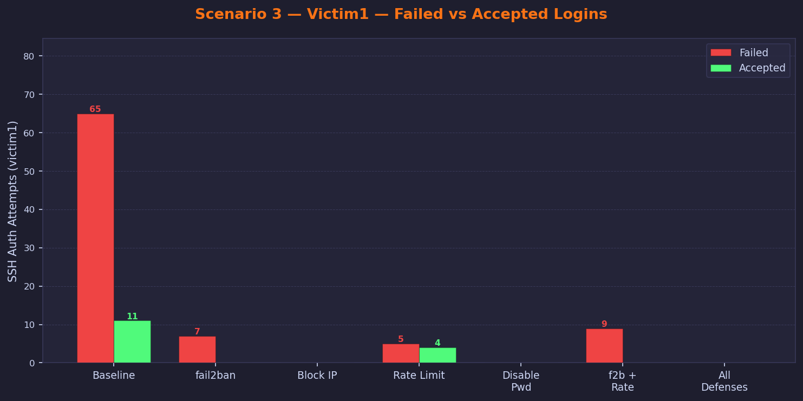 | 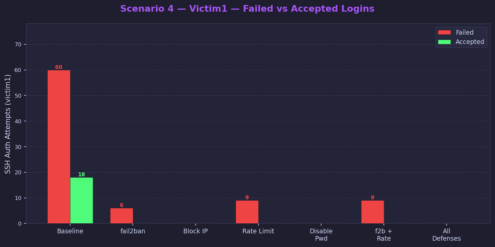 |
| 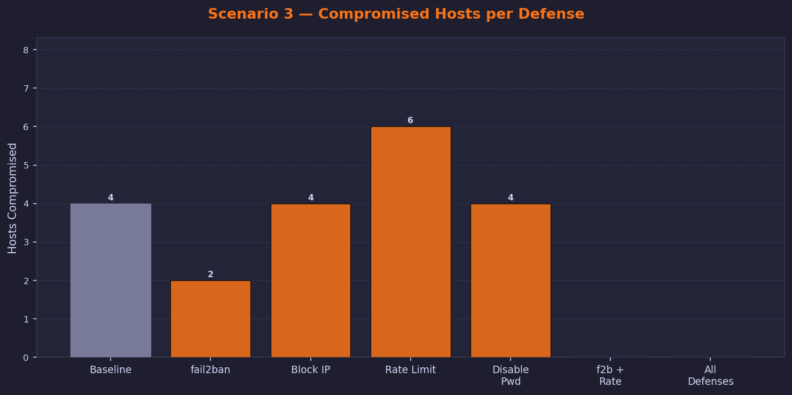 | 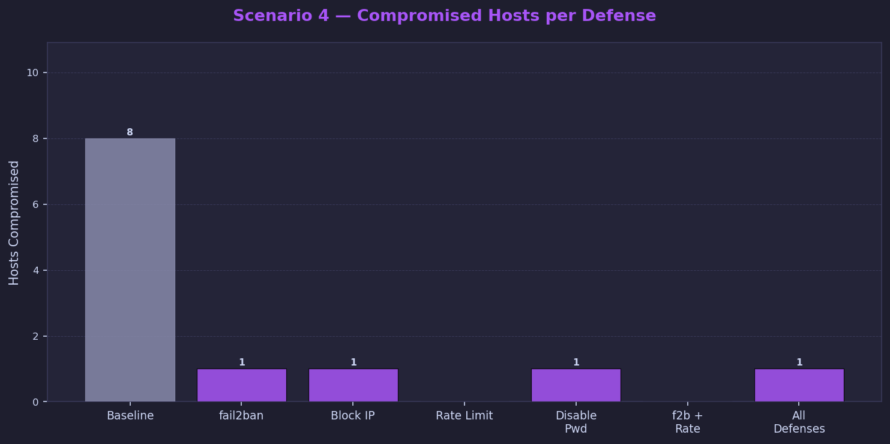 |

Regenerate charts:

```bash
# Defense comparison charts (all scenarios)
python3 src/visualize_defense_data.py --save

# Network topology diagrams
python3 src/network_topology.py --save
```

Output goes to `docs/charts/`.

---

## Auth log quick reference

```
# Failed brute-force attempt
Failed password for labuser from 172.21.0.10 port 54321 ssh2

# Successful login after brute-force
Accepted password for labuser from 172.21.0.10 port 54322 ssh2

# Lateral movement (source is internal, not attacker)
Failed password for labuser from 10.10.0.20 port 41234 ssh2
```

Watch live:
```bash
podman exec -it victim1 tail -f /var/log/auth.log
```

---

## Clean up

```bash
# Stop containers
podman compose down

# Full reset (removes images and volumes)
podman compose down --rmi all -v
```

---

## Safety

| Boundary | Enforcement |
|---|---|
| No internet access | All networks use `internal: true` |
| No host filesystem | No host volumes in victim/attacker containers |
| No raw sockets | Rootless Podman blocks them |
| No real attack tools | No hydra, metasploit, or nmap in containers |
| Safety check in botnet | `botnet.py` refuses non-lab IP ranges |
